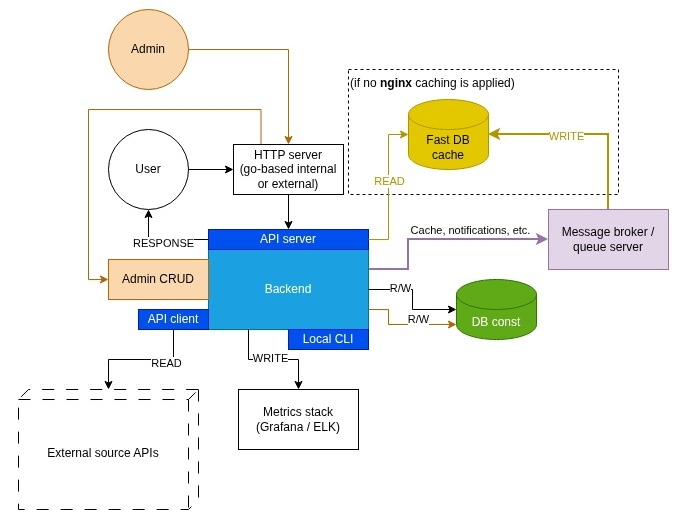

# lug-planets

Planned features: [TODO](docs/todo.md)

(the scheme reflects planned features along with already implemented ones)

## Engineering conventions

1. Comply with services common conventions:
   https://github.com/LuckyGuessServices/infrastructure/blob/main/docs/services-conventions.md
1. Store infrastructure-related scripts (installing external software, running docker containers) in a dedicated
   repository (common for all project's microservices): https://github.com/LuckyGuessServices/infrastructure
1. Apply DDD approach: the replacements of database engines, drivers, ORM may happen likely.
1. Cover functionality with integrational / functional tests (with the storage state restored for each test):
    * there should be a separate (for tests) storage that is filled once for _all_ test packages
      (not once for each package);
    * all data is sent and received as expected without losses during type conversions;
    * joined subsystems process data as expected (different engines may have different requirements and side effects).
1. Apply a standardized set of fixers and linters to ensure common, clean, safe coding style.
1. Try not to include lots of external libraries: consider developing similar functionality manually, if it takes
   not much time and possibly improves robustness and cleanliness (in comparison with potentially heavy and obscure
   libraries).
